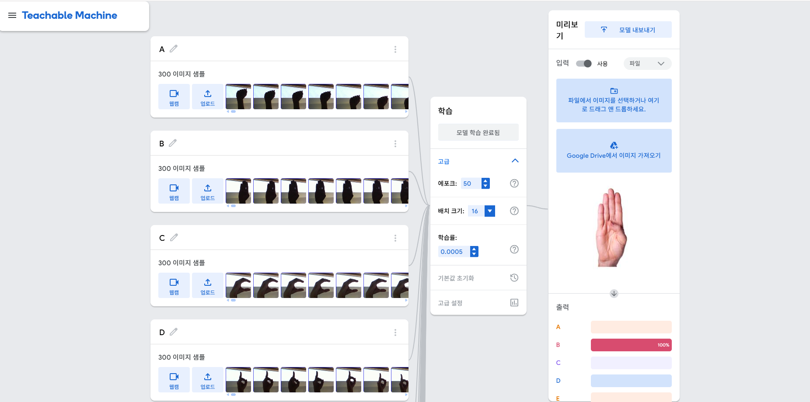
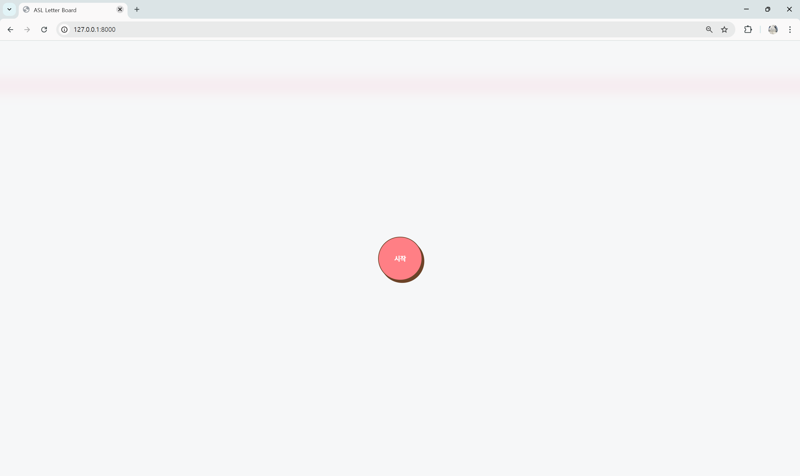
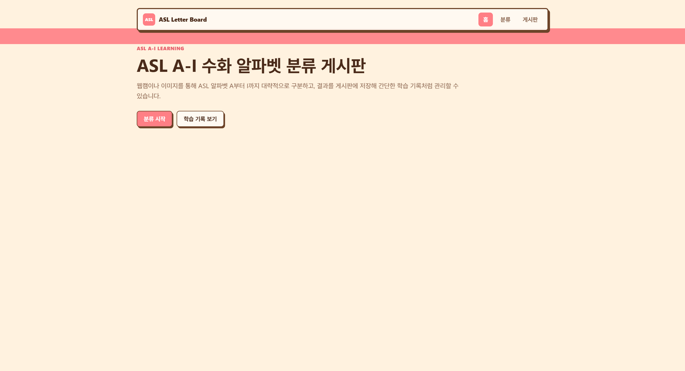
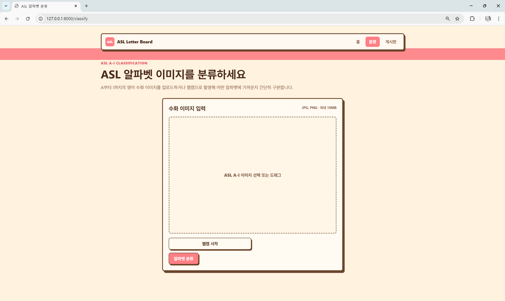
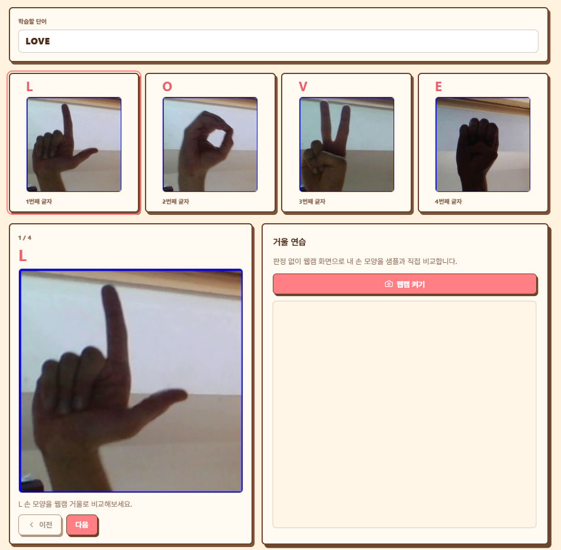
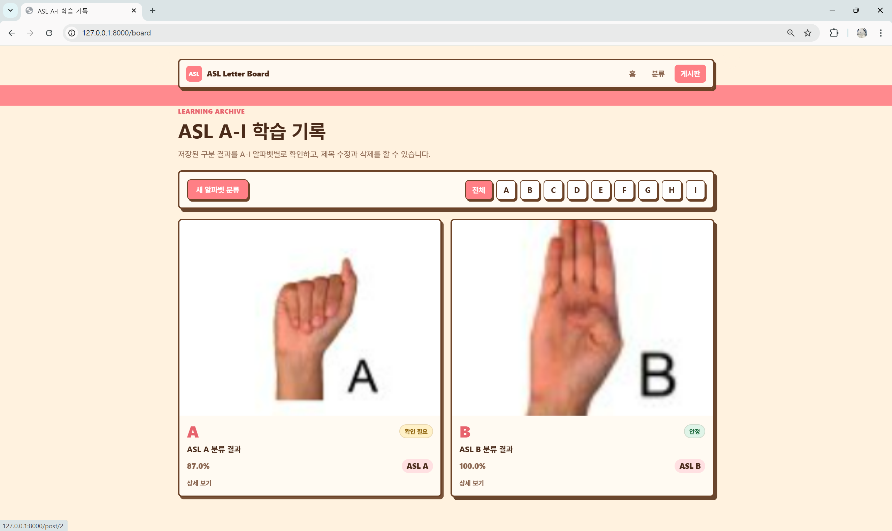

# ASL Letter Board

Teachable Machine으로 학습한 ASL 알파벳 이미지 분류 모델을 FastAPI와 React 화면에 연결한 프로젝트입니다.
사용자는 이미지 업로드 또는 웹캠 촬영으로 ASL A-Z 알파벳을 예측하고, 예측 결과를 게시판에 저장해 학습 기록처럼 관리할 수 있습니다.

단어 학습 화면은 특정 단어만 보여주는 방식에서 벗어나, 사용자가 원하는 영어 단어를 입력하면 각 알파벳의 ASL 샘플 이미지를 순서대로 확인하는 방식으로 개선했습니다. 모델 판정이 아직 완전히 안정적이지 않은 점을 고려해, 학습 화면에서는 자동 채점보다 웹캠을 거울처럼 사용해 샘플과 자신의 손 모양을 직접 비교하는 흐름에 집중했습니다.



## 주요 기능

- Teachable Machine Keras 모델(`keras_model.h5`) 기반 ASL A-Z 알파벳 이미지 분류
- `labels.txt`를 이용한 클래스 라벨 로딩 및 게시판 필터 생성
- 이미지 업로드, 드래그 앤 드롭, 웹캠 촬영 분석
- 예측 결과 Top 5, 신뢰도, 모델 정보, 추론 시간 표시
- 예측 결과 게시판 저장, 목록 조회, 상세 조회
- 게시글 제목 수정 및 삭제
- 원하는 영어 단어를 입력해 ASL 알파벳 샘플을 순서대로 학습
- 웹캠 거울 모드로 샘플 사진과 내 손 모양 비교
- SQLite 기반 로컬 데이터 저장

## 화면 구성

<table>
  <tr>
    <td width="50%"></td>
    <td width="50%"></td>
  </tr>
  <tr>
    <td width="50%"></td>
    <td width="50%"></td>
  </tr>
  <tr>
    <td width="50%"></td>
    <td width="50%"></td>
  </tr>
</table>

주요 경로:

- `/`: 홈 화면
- `/classify`: ASL 알파벳 분류 화면
- `/learning`: 단어 입력형 ASL 학습 화면
- `/board`: 저장된 학습 기록 게시판
- `/post/{id}`: 게시글 상세 화면
- `/webcam-test`: 웹캠 장치 테스트 화면

## 실행 방법

Python 패키지를 설치합니다.

```bash
pip install -r requirements.txt
```

React 화면을 빌드합니다.

```bash
cd frontend
npm install
npm run build
cd ..
```

FastAPI 서버를 실행합니다.

```bash
python -m uvicorn backend.app.main:app --reload
```

브라우저에서 아래 주소로 접속합니다.

```text
http://127.0.0.1:8000
```

웹캠 기능은 브라우저 권한이 필요합니다. 권한 요청이 뜨면 허용해야 촬영 분석과 거울 연습을 사용할 수 있습니다.

개발 중 React dev server를 따로 실행하려면 아래 명령을 사용합니다. Vite proxy가 `/api`, `/word-images`, `/static` 요청을 FastAPI 서버로 전달합니다.

```bash
cd frontend
npm run dev
```

## 모델 파일

Teachable Machine에서 TensorFlow/Keras 형식으로 내보낸 모델 파일을 아래 위치에 둡니다.

```text
ai/model/keras_model.h5
ai/model/labels.txt
```

`labels.txt`는 Teachable Machine 기본 형식을 지원합니다.

```text
0 A
1 B
2 C
...
25 Z
```

서비스는 라벨 파일을 읽어 예측 결과 이름과 게시판 필터를 구성합니다.

## 단어 학습 이미지

단어 학습 화면은 `docs/image/test_image`에 있는 A-Z 테스트 이미지를 알파벳 샘플로 사용합니다. 파일명은 `{알파벳}_test.jpg` 형식을 사용합니다.

```text
docs/image/test_image/
├─ A_test.jpg
├─ B_test.jpg
├─ C_test.jpg
...
└─ Z_test.jpg
```

FastAPI는 이 폴더를 `/test-images` 경로로 제공합니다.

```text
http://127.0.0.1:8000/test-images/A_test.jpg
http://127.0.0.1:8000/test-images/Z_test.jpg
```

현재 이미지는 테스트용이라 다소 어두울 수 있습니다. 이후 밝기와 배경을 보정한 A-Z 대표 이미지를 같은 파일명으로 교체하면 화면 로직을 바꾸지 않고 품질을 개선할 수 있습니다.

## API

### 이미지 예측

```http
POST /api/v1/predict
Content-Type: multipart/form-data
```

요청 필드:

- `file`: jpg, jpeg, png 이미지 파일

응답 예시:

```json
{
  "success": true,
  "filename": "sample.png",
  "predicted_class": "A",
  "confidence": 0.9821,
  "top_k": [
    { "label": "A", "score": 0.9821 },
    { "label": "B", "score": 0.0121 }
  ],
  "model": {
    "name": "keras_model.h5",
    "version": "v1"
  },
  "inference_time_ms": 123
}
```

### 라벨 조회

```http
GET /api/v1/predict/labels
```

응답 예시:

```json
{
  "classes": ["A", "B", "C"],
  "count": 3
}
```

### 게시글

```http
GET /api/v1/posts
GET /api/v1/posts?category=A
GET /api/v1/posts/{post_id}
POST /api/v1/posts
PUT /api/v1/posts/{post_id}
DELETE /api/v1/posts/{post_id}
```

게시글 저장 요청 예시:

```json
{
  "title": "ASL A 분류 결과",
  "image_url": "data:image/png;base64,...",
  "prediction": "A",
  "confidence": 0.95
}
```

## 프로젝트 구조

```text
Deeplearning_Board/
├─ ai/
│  └─ model/
│     ├─ keras_model.h5
│     └─ labels.txt
├─ backend/
│  └─ app/
│     ├─ main.py
│     ├─ routers/
│     │  ├─ pages.py
│     │  ├─ post.py
│     │  └─ predict.py
│     └─ services/
│        ├─ classifier_service.py
│        └─ post_service.py
├─ data/
│  └─ app.db
├─ docs/
│  └─ image/
│     ├─ test_image/
│     │  ├─ A_test.jpg
│     │  └─ ...
│     └─ words/
│        ├─ LOVE/
│        ├─ APPLE/
│        └─ manifest.json
├─ frontend/
│  ├─ src/
│  │  ├─ api/client.js
│  │  ├─ main.jsx
│  │  └─ style.css
│  ├─ static/
│  │  ├─ css/style.css
│  │  └─ images/placeholder.jpg
│  ├─ index.html
│  ├─ package.json
│  ├─ package-lock.json
│  └─ vite.config.js
├─ Dockerfile
├─ requirements.txt
└─ README.md
```

## 배포

이 프로젝트는 Hugging Face Spaces의 Docker 환경에 배포했습니다. Docker 빌드는 React 앱을 먼저 빌드한 뒤, FastAPI가 빌드된 정적 파일과 API를 하나의 서버에서 제공합니다.

https://huggingface.co/spaces/eunzzang/Deeplearning_Board

주의:

- 무료 Space는 재시작 시 SQLite 데이터가 초기화될 수 있습니다.
- 장기 저장이 필요하면 별도 데이터베이스나 persistent storage가 필요합니다.
- 첫 빌드는 TensorFlow 설치 때문에 시간이 걸릴 수 있습니다.

## 현재 한계와 향후 개선

- 현재 단어 학습 샘플은 테스트용 이미지라 밝기와 배경 품질을 추가로 보정할 수 있습니다.
- 이미지 분류 모델은 조명, 배경, 손 위치, 카메라 각도에 영향을 받을 수 있습니다.
- 단어 학습 화면의 웹캠은 현재 자동 채점이 아닌 거울 비교 용도입니다.
- 모델 정확도가 충분히 개선되면 글자별 수동 확인 기능을 추가할 수 있습니다.
- 자동체크 모드는 안정적인 예측 성능과 호출 제한 정책이 준비된 뒤 마지막 단계에서 도입하는 것이 적절합니다.

## 참고 사항

- 게시글 데이터는 `data/app.db`에 저장됩니다.
- `data/app.db`는 실행 중 자동 생성됩니다.
- 웹캠은 `http://127.0.0.1` 또는 HTTPS 환경에서 안정적으로 동작합니다.
- Teachable Machine 모델 호환을 위해 `tf-keras`를 사용합니다.
- `__pycache__`와 실행 중 생성 파일은 커밋 대상에서 제외하는 것을 권장합니다.
